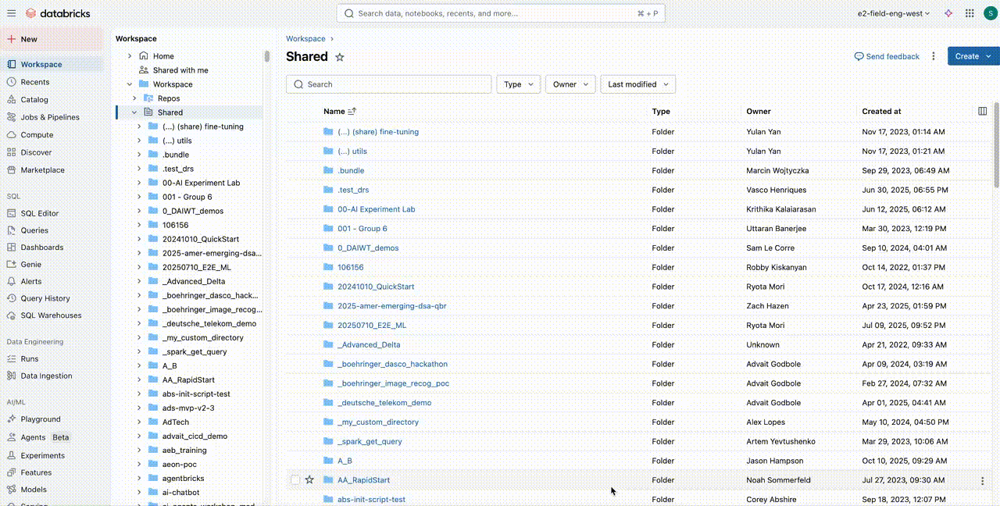

# 🚀 ETL Pipeline Setup and Run Guide

This guide details the steps required to set up and execute the ETL pipeline job within the Databricks workspace.

---

## 📽️ See It In Action: Pipeline Setup Walkthrough

For a quick visual reference on how to configure the pipeline, check out the animation below.

***Note:** Ensure your GIF file (`etl_code_setup.gif`) is located in the **`assets`** folder of this repository.*

---

## 1. 📂 Initial Setup: Clone the Git Repository

Before running the job, you need to clone this repository into your Databricks workspace.

1.  **Clone the Git folder** to a repository in your Databricks workspace.

---

## 2. 🏗️ Creating the ETL Pipeline

Once the Git folder is cloned, follow these steps to create your new ETL pipeline:

1.  Go to the **Workspace** section.
2.  Navigate to **ETL Pipeline** (or the corresponding Spark Declarative Pipeline/Pipelines section).
3.  Click **Create Pipeline** and give it a **New Name**.
4.  Select the **Default Catalog** and **Default Schema** for the pipeline.

---

## 3. ➕ Adding Source Assets (Pipeline Code)

You must link the pipeline definition in the cloned repository to the new pipeline:

1.  Click on **ADD existing assets**.
2.  Select the **Pipeline folder**.
3.  Select the **Root folder** (the one created when you cloned the repository).
4.  Select the **Internal add source files** and choose the required **Internal folders**.
5.  Click **Add**.

*You should now have a fully configured ETL pipeline ready to work on.*

---

## 4. ⚙️ Configuring the Pipeline Job Parameters

The job requires specific input parameters (like paths) to run correctly.

1.  Go to the **Settings** section of the newly created pipeline.
2.  Navigate to the **Configuration** tab.
3.  Click on **ADD configuration**.
4.  **Define all necessary input folder or parameters** required for the job.
    * **Example:** In this case, you will need to provide the `input_path`.
5.  Ensure all other variables and configurations are set correctly.

---

## 5. 🖥️ Compute Configuration (Optional)

Configure the compute environment as required:

* The default compute type is set to **Serverless**.
* **Event logs Unity Catalog Integration:** If you need to publish the event logs to **Unity Catalog**, select the corresponding option in Advanced Settings.

---

## 6. ▶️ Running the Job

1.  Once all configurations are complete, click on the **Dry Run** button.

*There you go! The job is ready for you to work on.*

